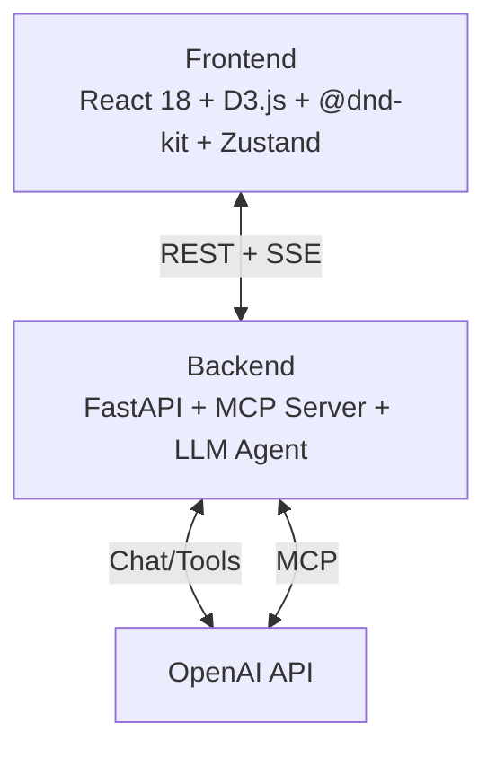

# AI Gantt Planner

Interactive Gantt chart + Kanban board with AI chat assistant. Edit project plans via natural language, import/export Excel files.

## Architecture



## Stack

| Layer | Tech |
|-------|------|
| Frontend | React 18, D3.js, @dnd-kit, Zustand, Vite |
| Backend | FastAPI, MCP (Model Context Protocol), OpenAI SDK |
| AI | OpenAI GPT (configurable model) |
| Infra | Docker, Kubernetes, Nginx |

## Quick Start

```bash
# Set required env vars
export OPENAI_API_KEY=sk-...
export OPENAI_BASE_URL=https://api.openai.com/v1  # optional
export OPENAI_MODEL=gpt-4o                         # optional

# Launch
docker compose up --build

# Open http://localhost:8401
```

## Local Development

```bash
# Backend
cd backend
pip install -r requirements.txt
uvicorn app.main:app --reload --port 8400

# Frontend
cd frontend
npm install
npm run dev   # http://localhost:8401
```

## Environment Variables

| Variable | Required | Default | Description |
|----------|----------|---------|-------------|
| `OPENAI_API_KEY` | Yes | — | OpenAI API key |
| `OPENAI_BASE_URL` | No | OpenAI default | Custom base URL (proxies, Azure) |
| `OPENAI_MODEL` | No | `gpt-4o` | Model name |

## Features

- **D3 Gantt Chart** — interactive timeline with drag, zoom, dependencies
- **Kanban Board** — drag-and-drop columns via @dnd-kit
- **AI Chat** — edit plans via natural language (streaming SSE)
- **Excel Import/Export** — upload `.xlsx`, download current plan
- **Task Modal** — create/edit tasks with full metadata
- **Seed Data** — one-click demo project with 12 tasks
- **MCP Server** — Model Context Protocol for tool-calling agents

## Chat Commands

AI chat supports two modes:
1. **Fast commands** (Bag-of-Words parser) — for simple, precise commands
2. **LLM fallback** — for complex natural language queries

### Fast Commands

| Command | Example | Description |
|---------|---------|-------------|
| `сдвинь [N]` | `Frontend сдвинь на 3 дня` | Shift task + dependents by N days |
| `перенеси [дата]` | `Backend перенеси на 2026-05-20` | Move task to absolute date |
| `скопируй` | `Design скопируй` | Duplicate task |
| `удали` | `Testing удали` | Delete task |
| `назначь [имя]` | `Backend назначь Иван` | Assign person to task |
| `добавь` | `добавь задачу Тест` | Create new task |

### LLM Fallback

When fast parser doesn't recognize the command, it falls back to LLM for:
- Complex multi-step operations
- Ambiguous requests
- Questions about the plan
- Any command in natural language

## API Endpoints

| Method | Path | Description |
|--------|------|-------------|
| `GET` | `/health` | Health check |
| `GET` | `/api/tasks/` | List all tasks |
| `GET` | `/api/tasks/{id}` | Get task by ID |
| `POST` | `/api/tasks/` | Create task |
| `PUT` | `/api/tasks/{id}` | Update task |
| `DELETE` | `/api/tasks/{id}` | Delete task |
| `POST` | `/api/chat/` | AI chat (SSE stream) |
| `POST` | `/api/excel/upload` | Import Excel file |
| `GET` | `/api/excel/export` | Export plan as Excel |
| `GET` | `/api/plan/` | Get full plan |
| `POST` | `/api/plan/seed` | Seed demo data |
| `DELETE` | `/api/plan/reset` | Clear all tasks |
| `POST` | `/mcp` | MCP protocol endpoint |

## Project Structure

```
biotech/
├── backend/
│   ├── app/
│   │   ├── main.py          # FastAPI app, CORS, lifespan
│   │   ├── models.py        # Pydantic models
│   │   ├── store.py         # In-memory task store
│   │   ├── llm_agent.py     # OpenAI integration
│   │   ├── mcp_server.py    # MCP protocol server
│   │   ├── excel_service.py # Excel parse/export
│   │   └── routes/
│   │       ├── tasks.py     # Task CRUD
│   │       ├── chat.py      # AI chat SSE
│   │       ├── excel.py     # Import/export
│   │       └── plan.py      # Plan seed/reset
│   └── Dockerfile
├── frontend/
│   ├── src/
│   │   ├── App.tsx
│   │   ├── main.tsx
│   │   ├── store/index.ts       # Zustand store
│   │   ├── types/index.ts       # TypeScript types
│   │   ├── api/                 # API client modules
│   │   ├── hooks/useGantt.ts    # D3 hook
│   │   └── components/
│   │       ├── GanttView.tsx
│   │       ├── KanbanView.tsx
│   │       ├── ChatPanel.tsx
│   │       ├── TaskModal.tsx
│   │       ├── ExcelHandler.tsx
│   │       ├── Header.tsx
│   │       └── ViewSwitcher.tsx
│   └── Dockerfile
├── k8s/                     # Kubernetes manifests
├── docker-compose.yml
└── sample_tasks.xlsx
```

## AI Usage

AI assistants were used throughout development:

- **Brainstorming** — architecture decisions, tech stack selection, feature scoping
- **Code Generation** — scaffolding components, routes, services, Docker configs
- **Architecture Design** — MCP integration pattern, SSE streaming, store design
- **Testing** — edge case identification, manual test scenarios
- **Documentation** — README, ROADMAP, inline docstrings

All AI-generated code was reviewed and adjusted for correctness.

## Demo

> **Placeholder** — add a screen recording showing:
> 1. Upload `sample_tasks.xlsx` via Excel import
> 2. Edit plan via AI chat: *"Move Backend Development to start July 1st"*
> 3. Export updated plan as Excel
>
> 
