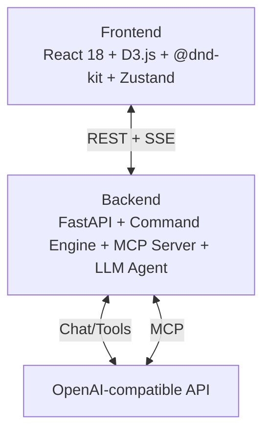

# AI Gantt Planner

Interactive Gantt chart + Kanban board with AI chat assistant. Edit project plans via natural language, import/export Excel files. Full Russian i18n support.

## Architecture



## Stack

| Layer | Tech |
|-------|------|
| Frontend | React 18, D3.js, @dnd-kit, Zustand, Vite, TypeScript |
| Backend | FastAPI, Command Engine (Bag-of-Words), MCP (Model Context Protocol), OpenAI SDK |
| AI | OpenAI GPT / any OpenAI-compatible API (Kimi, DashScope, etc.) |
| Infra | Docker, Kubernetes, Nginx |
| Testing | Vitest (frontend), Pytest (backend) |

## Quick Start

```bash
# Set required env vars
export OPENAI_API_KEY=sk-...
export OPENAI_BASE_URL=https://api.openai.com/v1  # optional
export OPENAI_MODEL=gpt-4o                         # optional

# Launch
docker compose up --build

# Open http://localhost:8401
```

## Local Development

```bash
# Backend
cd backend
pip install -e ".[dev,test]"
uvicorn app.main:app --reload --port 8400

# Frontend
cd frontend
npm install
npm run dev   # http://localhost:8401
```

## Environment Variables

| Variable | Required | Default | Description |
|----------|----------|---------|-------------|
| `OPENAI_API_KEY` | Yes | — | OpenAI API key |
| `OPENAI_BASE_URL` | No | OpenAI default | Custom base URL (proxies, Azure, DashScope) |
| `OPENAI_MODEL` | No | `gpt-4o` | Model name |
| `JWT_SECRET` | Yes | — | JWT signing secret |
| `ADMIN_USER` | No | `admin` | Admin username |
| `ADMIN_PASS` | No | `admin` | Admin password |
| `HOST` | No | `0.0.0.0` | Server bind host |
| `PORT` | No | `8400` | Server port |

## Features

- **D3 Gantt Chart** — interactive timeline with drag, zoom, dependencies, context menu
- **Kanban Board** — drag-and-drop columns via @dnd-kit, assignee-based grouping
- **AI Chat** — edit plans via natural language (streaming SSE)
- **Command Engine** — fast Bag-of-Words parser for instant command execution
- **Excel Import/Export** — upload `.xlsx` (merge/overwrite modes), download current plan
- **iCal Export** — export plan as calendar events
- **Task Modal** — create/edit tasks with full metadata, view/edit modes
- **Suggestions Panel** — AI-powered task suggestions
- **Settings Modal** — runtime LLM configuration (API key, base URL, model)
- **Auth** — JWT-based login with session management
- **Auto-save** — automatic plan persistence to JSON
- **Notifications** — toast system for user feedback
- **Confirm Modal** — safe deletion with confirmation dialogs
- **Seed Data** — one-click demo project with 12 tasks
- **MCP Server** — Model Context Protocol for tool-calling agents
- **i18n** — full Russian UI localization
- **Example Projects** — 4 sample Excel files (pipeline, parallel, complex, no-deps)

## Chat Commands

AI chat supports two modes:
1. **Fast commands** (Bag-of-Words parser) — for simple, precise commands (instant, no LLM cost)
2. **LLM fallback** — for complex natural language queries

### Fast Commands

| Command | Example | Description |
|---------|---------|-------------|
| `сдвинь [N]` | `Frontend сдвинь на 3 дня` | Shift task + dependents (subtree) by N days |
| `сдвинь [N] назад` | `Backend сдвинь на 2 дня назад` | Shift task + dependents backward |
| `перенеси [дата]` | `Backend перенеси на 2026-05-20` | Move task to absolute date |
| `скопируй` | `Design скопируй` | Duplicate task |
| `удали` | `Testing удали` | Delete task |
| `назначь [имя]` | `Backend назначь Иван` | Assign person to task |
| `добавь` | `добавь задачу Тест` | Create new task |
| `свяжи` | `Testing связана с Backend` | Link dependency (auto-creates missing tasks) |

### LLM Fallback

When fast parser doesn't recognize the command, it falls back to LLM for:
- Complex multi-step operations
- Ambiguous requests
- Questions about the plan
- Any command in natural language

## API Endpoints

| Method | Path | Description |
|--------|------|-------------|
| `GET` | `/health` | Health check |
| `GET` | `/api/tasks/` | List all tasks |
| `GET` | `/api/tasks/{id}` | Get task by ID |
| `POST` | `/api/tasks/` | Create task |
| `PUT` | `/api/tasks/{id}` | Update task |
| `DELETE` | `/api/tasks/{id}` | Delete task |
| `POST` | `/api/chat/` | AI chat (SSE stream) |
| `POST` | `/api/excel/upload` | Import Excel file |
| `GET` | `/api/excel/export` | Export plan as Excel |
| `POST` | `/api/excel/ical` | Export plan as iCal |
| `GET` | `/api/plan/` | Get full plan |
| `POST` | `/api/plan/seed` | Seed demo data |
| `POST` | `/api/plan/save` | Save plan to JSON |
| `DELETE` | `/api/plan/reset` | Clear all tasks |
| `GET` | `/api/settings/llm` | Get LLM settings |
| `POST` | `/api/settings/llm` | Update LLM settings |
| `POST` | `/auth/login` | JWT login |
| `POST` | `/auth/logout` | JWT logout |
| `POST` | `/mcp` | MCP protocol endpoint |

## Project Structure

```
biotech/
├── backend/
│   ├── app/
│   │   ├── main.py              # FastAPI app, CORS, lifespan, auth
│   │   ├── models.py            # Pydantic models
│   │   ├── store.py             # In-memory task store + JSON persistence
│   │   ├── llm_agent.py         # OpenAI integration
│   │   ├── command_engine.py    # Bag-of-Words command parser
│   │   ├── mcp_server.py        # MCP protocol server
│   │   ├── excel_service.py     # Excel parse/export
│   │   └── routes/
│   │       ├── tasks.py         # Task CRUD
│   │       ├── chat.py          # AI chat SSE
│   │       ├── excel.py         # Import/export (xlsx, ical)
│   │       ├── plan.py          # Plan seed/reset/save
│   │       └── settings.py      # Runtime LLM config
│   ├── tests/                   # Pytest test suite
│   ├── pyproject.toml           # Dependencies (hatch)
│   └── Dockerfile
├── frontend/
│   ├── src/
│   │   ├── App.tsx
│   │   ├── main.tsx
│   │   ├── i18n.ts              # Russian UI localization
│   │   ├── store/index.ts       # Zustand store
│   │   ├── types/index.ts       # TypeScript types
│   │   ├── api/                 # API client modules
│   │   ├── hooks/useGantt.ts    # D3 hook
│   │   ├── styles/              # CSS styles
│   │   └── components/
│   │       ├── GanttView.tsx
│   │       ├── KanbanView.tsx
│   │       ├── ChatPanel.tsx
│   │       ├── CommandOverlay.tsx    # Command palette overlay
│   │       ├── SuggestionsPanel.tsx  # AI suggestions
│   │       ├── TaskFormModal.tsx     # Task create/edit form
│   │       ├── TaskModal.tsx
│   │       ├── CreateTaskModal.tsx
│   │       ├── ContextMenu.tsx       # Right-click context menu
│   │       ├── ConfirmModal.tsx      # Confirmation dialogs
│   │       ├── Notification.tsx      # Toast notifications
│   │       ├── SettingsModal.tsx     # LLM settings UI
│   │       ├── AuthModal.tsx         # Login modal
│   │       ├── ExcelHandler.tsx
│   │       ├── Header.tsx
│   │       └── ViewSwitcher.tsx
│   ├── test/                    # Vitest test suite
│   ├── nginx.conf
│   ├── Dockerfile
│   └── vite.config.ts
├── k8s/                         # Kubernetes manifests
│   ├── backend-deployment.yaml
│   ├── frontend-deployment.yaml
│   ├── backend-service.yaml
│   ├── frontend-service.yaml
│   ├── ingress.yaml
│   ├── configmap.yaml
│   ├── secret.yaml
│   ├── hpa.yaml                 # Horizontal Pod Autoscaler
│   ├── pdb.yaml                 # Pod Disruption Budget
│   └── kustomization.yaml
├── examples/                    # Sample Excel projects
│   ├── simple_pipeline.xlsx
│   ├── parallel_modules.xlsx
│   ├── complex_project.xlsx
│   └── no_dependencies.xlsx
├── brainstorm/                  # Brainstorm pipeline outputs
├── workspace/                   # Working directory (temp files)
├── docker-compose.yml
├── .env.example
└── generate_samples.py          # Sample Excel generator
```

## Testing

```bash
# Backend tests
cd backend
pytest

# Frontend tests
cd frontend
npm test
```

Test suites:
- **Backend**: Pytest — unit tests for command engine, store, routes
- **Frontend**: Vitest — store tests, Gantt hook tests, component tests, E2E tests

## Kubernetes Deployment

```bash
# Apply manifests
kubectl apply -k k8s/

# Or individual files
kubectl apply -f k8s/configmap.yaml
kubectl apply -f k8s/secret.yaml
kubectl apply -f k8s/backend-deployment.yaml
kubectl apply -f k8s/frontend-deployment.yaml
kubectl apply -f k8s/ingress.yaml
```

K8s features:
- **HPA** — horizontal pod autoscaling
- **PDB** — pod disruption budget for high availability
- **Ingress** — Nginx ingress with TLS termination
- **ConfigMap/Secret** — environment configuration

## AI Usage

AI assistants were used throughout development:

- **Brainstorming** — architecture decisions, tech stack selection, feature scoping
- **Code Generation** — scaffolding components, routes, services, Docker configs
- **Architecture Design** — MCP integration pattern, SSE streaming, store design
- **Testing** — edge case identification, manual test scenarios
- **Documentation** — README, ROADMAP, inline docstrings

All AI-generated code was reviewed and adjusted for correctness.

## Demo

> **Placeholder** — add a screen recording showing:
> 1. Upload `sample_tasks.xlsx` via Excel import
> 2. Edit plan via AI chat: *"Move Backend Development to start July 1st"*
> 3. Export updated plan as Excel
>
> 
