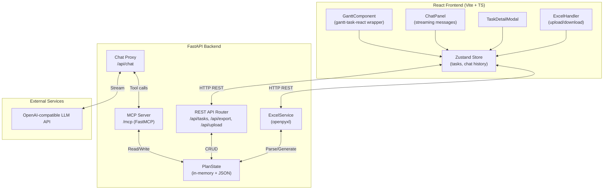
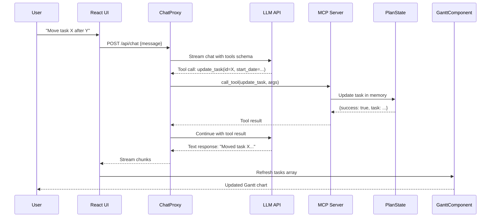
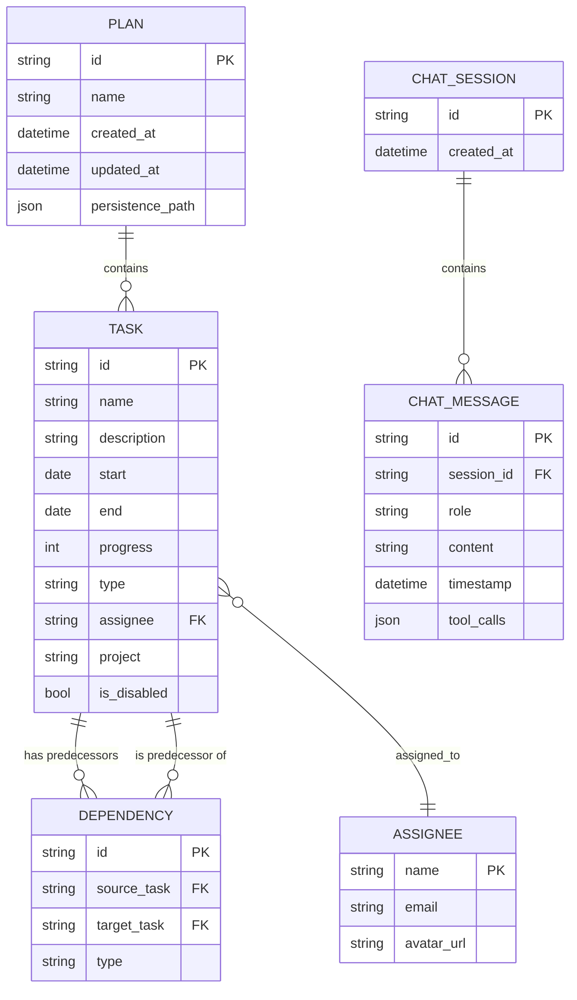
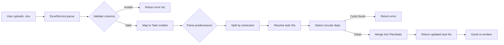

# Diagrams — AI-Native Gantt Planner

## Diagram 1: System Architecture

```mermaid
graph TB
    subgraph Frontend["React Frontend (Vite + TS)"]
        Gantt["GanttComponent<br/>(gantt-task-react wrapper)"]
        Chat["ChatPanel<br/>(streaming messages)"]
        Modal["TaskDetailModal"]
        Excel["ExcelHandler<br/>(upload/download)"]
        Store["Zustand Store<br/>(tasks, chat history)"]
    end

    subgraph Backend["FastAPI Backend"]
        REST["REST API Router<br/>/api/tasks, /api/export, /api/upload"]
        ChatAPI["Chat Proxy<br/>/api/chat"]
        MCP["MCP Server<br/>/mcp (FastMCP)"]
        State["PlanState<br/>(in-memory + JSON)"]
        ExcelSvc["ExcelService<br/>(openpyxl)"]
    end

    subgraph External["External Services"]
        LLM["OpenAI-compatible LLM API"]
    end

    Gantt --> Store
    Chat --> Store
    Modal --> Store
    Excel --> Store

    Store <-->|HTTP REST| REST
    Store <-->|HTTP REST| ExcelSvc
    ChatAPI <-->|Stream| LLM
    ChatAPI <-->|Tool calls| MCP
    MCP <-->|Read/Write| State
    REST <-->|CRUD| State
    ExcelSvc <-->|Parse/Generate| State
```

## Diagram 2: Chat Edit Data Flow

```mermaid
sequenceDiagram
    participant U as User
    participant UI as React UI
    participant CP as ChatProxy
    participant LLM as LLM API
    participant MCP as MCP Server
    participant PS as PlanState
    participant GC as GanttComponent

    U->>UI: "Move task X after Y"
    UI->>CP: POST /api/chat {message}
    CP->>LLM: Stream chat with tools schema
    LLM-->>CP: Tool call: update_task(id=X, start_date=...)
    CP->>MCP: call_tool(update_task, args)
    MCP->>PS: Update task in memory
    PS-->>MCP: {success: true, task: ...}
    MCP-->>CP: Tool result
    CP->>LLM: Continue with tool result
    LLM-->>CP: Text response: "Moved task X..."
    CP-->>UI: Stream chunks
    UI->>GC: Refresh tasks array
    GC-->>U: Updated Gantt chart
```

## Diagram 3: Entities

```mermaid
erDiagram
    PLAN ||--o{ TASK : contains
    TASK ||--o{ DEPENDENCY : "has predecessors"
    TASK ||--o{ DEPENDENCY : "is predecessor of"
    TASK }o--|| ASSIGNEE : assigned_to
    CHAT_SESSION ||--o{ CHAT_MESSAGE : contains

    PLAN {
        string id PK
        string name
        datetime created_at
        datetime updated_at
        json persistence_path
    }

    TASK {
        string id PK
        string name
        string description
        date start
        date end
        int progress
        string type
        string assignee FK
        string project
        bool is_disabled
    }

    DEPENDENCY {
        string id PK
        string source_task FK
        string target_task FK
        string type
    }

    ASSIGNEE {
        string name PK
        string email
        string avatar_url
    }

    CHAT_SESSION {
        string id PK
        datetime created_at
    }

    CHAT_MESSAGE {
        string id PK
        string session_id FK
        string role
        string content
        datetime timestamp
        json tool_calls
    }
```

## Diagram 4: Excel Import Flow

```mermaid
flowchart LR
    A[User uploads .xlsx] --> B[ExcelService.parse]
    B --> C{Validate columns}
    C -->|Invalid| D[Return error list]
    C -->|Valid| E[Map to Task models]
    E --> F{Parse predecessors}
    F --> G[Split by semicolon]
    G --> H[Resolve task IDs]
    H --> I[Detect circular deps]
    I -->|Cycle found| J[Return error]
    I -->|Clean| K[Merge into PlanState]
    K --> L[Return updated task list]
    L --> M[Gantt re-renders]
```
