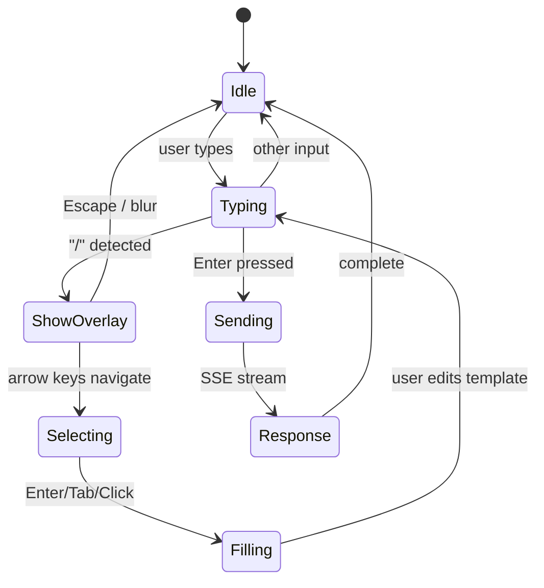

# Diagrams: Chat Command Suggestions

## Diagram 1: Current vs New Flow

```mermaid
flowchart TB
    subgraph CURRENT
        U1[User types message] --> S1[sendChat SSE]
        S1 --> E1[CommandEngine parse]
        E1 -->|success| R1[Text response]
        E1 -->|fail| L1[LLM suggest_commands]
        L1 --> R2[Suggestion buttons rendered]
    end

    subgraph NEW
        U2[User types "/" ] --> D1[Detect trigger]
        D1 --> O1[Show CommandOverlay]
        O1 --> U3[User selects command]
        U3 --> F1[Fill input with template]
        F1 --> U4[User edits + sends]
        U4 --> S2[sendChat SSE]
        S2 --> E2[CommandEngine parse]
        E2 --> R3[Text response]
    end

    style CURRENT fill:#1a1a2e,stroke:#444
    style NEW fill:#1a2a1e,stroke:#4a9
```

## Diagram 2: Component Architecture

```mermaid
flowchart LR
    CP[ChatPanel] --> O[CommandOverlay]
    O --> C1[CommandItem × 7]
    CP --> I[TextInput]
    I -->|onChange detect| D{"/" trigger?}
    D -->|yes| O
    D -->|no| H[Hide overlay]
    CP --> S[SuggestionButtons]
    S -. coexist .-> O

    style CP fill:#2a2a4e,stroke:#4A90D9
    style O fill:#1a2a1e,stroke:#4a9
    style S fill:#3a2a1e,stroke:#d94
```



## Diagram 3: State Flow


